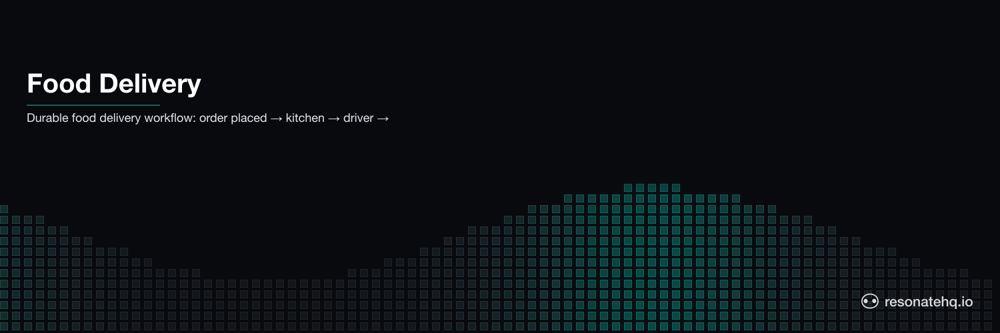

<p align="center">
  <picture>
    <source media="(prefers-color-scheme: dark)" srcset="./assets/banner-dark.png">
    <source media="(prefers-color-scheme: light)" srcset="./assets/banner-light.png">
    
  </picture>
</p>

# Food Delivery Workflow

A multi-step food delivery pipeline with durable crash recovery. Models a full delivery: order placed → kitchen prepares → driver assigned → pickup → delivery → complete.

If anything crashes mid-delivery — driver app drops, network partition, process restart — the workflow resumes from the last checkpoint. The order is not re-placed. The food is not re-cooked. Execution resumes exactly where it left off.

## What This Demonstrates

- **Multi-step durable workflow**: 6 sequential steps, each checkpointed
- **Crash recovery**: fail at any step, restart, resume from that step
- **Automatic retry**: failed steps retry automatically without re-running earlier steps
- **Compensation path**: if no driver is available, issue a refund and abort cleanly

## Prerequisites

- [Bun](https://bun.sh) v1.0+

No external services required. Resonate runs in embedded mode.

## Setup

```bash
git clone https://github.com/resonatehq-examples/example-food-delivery-ts
cd example-food-delivery-ts
bun install
```

## Run It

**Happy path** — end-to-end delivery:
```bash
bun start
```

```
=== Food Delivery Workflow ===
Mode: HAPPY PATH (end-to-end delivery)

[order]      Placing order order-... at Mario's Pizza...
[order]      Order order-... confirmed by restaurant
[kitchen]    Preparing order order-...
[kitchen]    Order order-... is ready for pickup
[dispatch]   Finding driver for order order-...
[dispatch]   Driver driver-738 assigned to order order-...
[pickup]     Driver driver-738 picking up order order-...
[pickup]     Order order-... picked up — en route to customer
[delivery]   Driver driver-738 delivering order order-... (attempt 1)...
[delivery]   Order order-... delivered to customer
[complete]   Completing order order-..., releasing driver driver-738...
[complete]   Order order-... done at 2026-02-23T...

=== Result ===
{ "status": "success", "orderId": "...", "driverId": "driver-738", "completedAt": "..." }
```

**Crash mode** — driver app fails mid-delivery, then recovers:
```bash
bun start:crash
```

```
=== Food Delivery Workflow ===
Mode: CRASH (driver app fails on first delivery attempt, then recovers)

[order]      Placing order order-... at Mario's Pizza...
[order]      Order order-... confirmed by restaurant
[kitchen]    Preparing order order-...
[kitchen]    Order order-... is ready for pickup
[dispatch]   Finding driver for order order-...
[dispatch]   Driver driver-160 assigned to order order-...
[pickup]     Driver driver-160 picking up order order-...
[pickup]     Order order-... picked up — en route to customer
[delivery]   Driver driver-160 delivering order order-... (attempt 1)...
Runtime. Function 'deliverOrder' failed with 'Error: Driver app connection lost' (retrying in 2 secs)
[delivery]   Driver driver-160 delivering order order-... (attempt 2)...
[delivery]   Order order-... delivered to customer
[complete]   Completing order order-..., releasing driver driver-160...

=== Result ===
{ "status": "success", ... }
```

**Notice**: steps 1-4 each printed exactly once. Step 5 failed and retried in place. This is durable execution.

## What to Observe

1. **No re-execution of completed steps**: in crash mode, the order is placed and prepared once. The kitchen log appears once. Retry only affects the failing step.
2. **The retry message is Resonate**: `Runtime. Function '...' failed (retrying in N secs)` comes from the SDK. You don't write retry logic.
3. **Change the crash point**: in `src/steps.ts`, move the throw to a different step — restart shows exactly that step retrying, all prior steps skipped.

## The Code

The workflow is 40 lines in [`src/workflow.ts`](src/workflow.ts):

```typescript
export function* deliverFood(ctx: Context, order: Order, crashMidDelivery: boolean) {
  const orderId = yield* ctx.run(placeOrder, order);
  yield* ctx.run(prepareOrder, orderId);

  let driverId: string;
  try {
    driverId = yield* ctx.run(assignDriver, orderId);
  } catch {
    yield* ctx.run(refundOrder, orderId);
    return { status: "failed_no_driver", orderId };
  }

  yield* ctx.run(pickupOrder, orderId, driverId);
  yield* ctx.run(deliverOrder, orderId, driverId, crashMidDelivery);
  const result = yield* ctx.run(completeOrder, orderId, driverId);

  return { status: "success", ...result };
}
```

Six steps, sequential, crash-proof. No signals. No queries. No task queues.

## File Structure

```
example-food-delivery-ts/
├── src/
│   ├── index.ts       Entry point — Resonate setup and workflow invocation
│   ├── workflow.ts    Delivery workflow — 6 durable steps
│   └── steps.ts       Step implementations — simulated restaurant/driver APIs
├── package.json
└── tsconfig.json
```

**Lines of code**: ~180 total, ~60 lines of actual logic.

## Why the workflow is the delivery

The end-to-end delivery flow — order → kitchen → driver → pickup → delivery — lives in a single generator function. Each step is a `ctx.run()` that durably records its result. Crash at any point, restart, and the workflow resumes from the first uncompleted step; prior steps are replayed from the promise store without re-invoking side effects.

No signal registration for driver updates, no query handlers for state, no separate task services for each stage. The linear generator IS the delivery lifecycle. For scenarios where asynchronous external events must push into the workflow mid-flight (live driver-location updates, customer cancellations), see [example-human-in-the-loop-ts](https://github.com/resonatehq-examples/example-human-in-the-loop-ts).

## Learn More

- [Resonate documentation](https://docs.resonatehq.io)
- [Human-in-the-loop pattern](https://github.com/resonatehq-examples/example-human-in-the-loop-ts) — pushing async events into a running workflow
